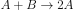
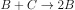
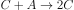
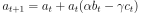
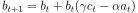
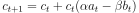

# bz_shader
Simple Belousov-Zhabotinsky(BZ) reaction simulator with shader on Processing.

## Screenshots

## Model
A simple model for BZ reaction has been proposed by A. Turner [1]. We assume that three chemical substances react following the chemical equations described below.

where _α_, _β_, and _γ_ denote the rate constants of the chemical reactions, respectively. The concentrations of the substances at _t_ + 1, _a__t_+1, _b__t_+1, and _c__t_+1 are expressed by those at _t_, _a__t_, _b__t_, and _c__t_.

## References
[1] A. Turner, A Simple Model of the Belousov-Zhabotinsky Reaction from First Principles, 2009
